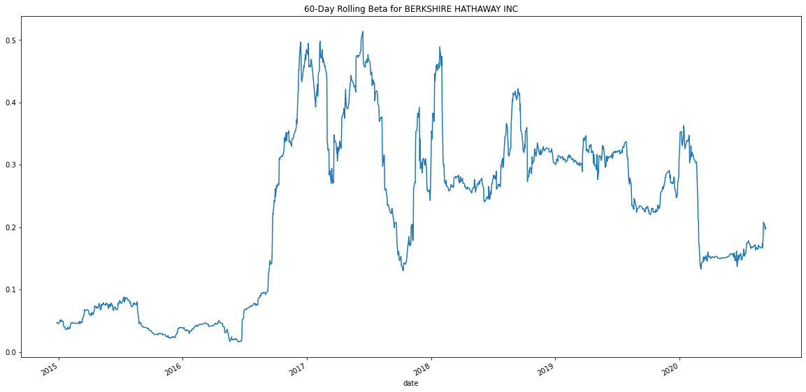

# portfolio_analysis
###  The daily return data of the 4 funds and the S&P 500 

###
The cumulative return values for the four funds and the S&P 500 over time

### box plots to reflect the return data for only the 4 fund portfolios ( shows the highest volitie is the Berkshare hathway)

### The Bershire Hawthway offers the highest best risk-return while the paulson & Co Inc is the lowest ( the sharp Ratio)

#### The 60-day rolling beta for Berkshire Hathaway  LLC

##### The 60-day rolling beta for Tiger Global Management LLC

##### Based on the daily and annualized return analysis  , the Berkshire Hathaway is higher than the Global Management , in contrast the beta (senstiven of the portfolio to the S&P 500)  of Global Management LLC is less than the Berkshare Hathaway . factors to decide may depend  on risk tolerance , pools of existing portfolio the firm poses and investment priorites of the firm. My recommendation : eventhough the Berkshare Hathaway yields a higher return than the Global Management LLC, since the Global Management still gives a postive return at the same time less volatile to over all market( S&P 500) , I choose the Global Management portfolio to be part of firms fund. 

